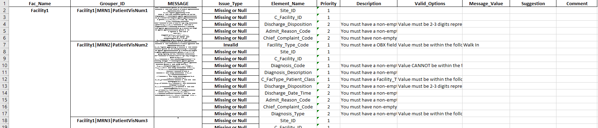

# README:  Locate NSSP Elements

Click to expand

    
stuff

    

## Background

I was given the task of creating Python scripts to parse NSSP Priority Elements out of an ADT HL7 Message.
See terminology definitions below:

* HL7 Messages - A tree-type data structure that contains information related to a hospital visit
* ADT - Acronym for Admission/Discharge/Transfer records.
* NSSP Priority Elements - Important information from the visit.
Importance determined by National Syndromic Surveillance Program (NSSP). 
Examples of NSSP Priority elements include Patient_Age and Admit_Date_Time

It should be noted that for many messages, some NSSP Priority Elements are missing. 
This could be a result of problematic hospital procedures, a patient not disclosing information, or complicated visits.
Some elements are located in one message location and are relatively easy to parse.
Other elements follow heirchical arguments (ex:  Take the first non-null value of location1, location2).
More complex elements require even more complex if-elif-else logic.

For a list of all NSSP Priority Elements and their descriptions, see the excel file <b>'data/processed/NSSP_Element_Reader.xlsx'</b>

-------------

Once I was able to pull NSSP Priority elements from an HL7 message, I moved on to assessing the completness and timeliness of the HL7 Messages in accordance with NSSP standards.

The last project task was to create a comprehensive dataframe of message errors.
In general, each row describes the error and how to fix it.

## Repository Structure

There are three primary folders and one optional folder within this repository:
* data - where data files are stored
  * raw/ - <b><u>ACTION REQUIRED</u></b> directory where the user (you) must put SQL-outputted csv dataframes from PHESS-ED data
  * processed/ - directory where you can save output dataframes to.
    * NSSP_Element_Reader - file describing element locations and code to execute in our NSSP_Element_Grabber() function.
    * NSSP_Validity_Reader - file describing characteristics of valid NSSP Priority Elements and code as to check for validity.
    * Message_Corrector_Key - file with important information about element locations and code to provide suggestions for invalid values.
    
* python - Jupyter Notebooks / Python Files that make up the bulk of the project.
  * pj_funcs.py - file that holds all of my defined functions from the entire project.
  All functions are well-annotated and can be seen by typing the name of a function followed by a question mark in a jupyter notebook cell and then running it.
  An example of this would be `NSSP_Element_Grabber?'
  
  * 1.  NSSP Element Grabber Explanation - file that describes in detail the process behind creating NSSP_Element_Grabber().
  * 2.  Visit Timeliness Report by Facility - file that describes in detail the process behind creating timeliness_facvisits_hours().
  * 3.  Visit Completeness Report by Facility - file that describes in detail the process behind creating completeness_facvisits().
  * 4.  Issues By HL7 Message - file that describes in detail the process behind creating issues_in_messages().
  * Experimentation Ideas - file that shows the functionality of all of my functions and describes potential useful code.
  * Your Notebook - file for user to experiment with my functions and play around.
  
 * pics/ - directory where some supporting images for our markdown cells live

* supporting - all documents that aided me in determining my procedure and how I went about this project.

* figures (optional) - directory to place any useful images you may plot.

## User ACTION REQUIRED

<ol>
 <li> You need to run an SQL query on the PHESS ED (emergency department) data.
  Save the data as a csv file within the 'data/raw/' directory. </li>
 <li> If you are curious as to how my functions were created, read through python files 1. , 2. , 3. , or 4. </li>
 <li> Otherwise, read through 'python/Experimentation Ideas' to see my functions in action </li>
 <li> Navigate to 'python/Your Notebook' and experiment for yourself. </li>
</ol>

## External Supporting Libraries

[Pandas](https://pandas.pydata.org/) - this library is of Python's finest libraries for managing, querying, and writing dataframes.
This library was crucial to this project.  

[HL7](https://python-hl7.readthedocs.io/en/latest/) - this library provided a smooth path to navigate an HL7 message, a complex tree-structured dataframe that varies message-to-message.

[Numpy](https://numpy.org/) - this library makes working with lists much easier.
It is also extremely compatible with pandas.

[Matplotlib](https://matplotlib.org/) - this library is wonderful for plotting.

Some of Python's useful internal supporting libraries included Time (for keeping track of runtimes) and Re (for using Regular Expressions)

## The Author
PJ Gibson - Data Analyst for Indiana State Department of Health

## Special Thanks
* Harold Gil - Director of Public Health Informatics for Indiana State Department of Health.
Harold assigned me this project, gave me relevant supporting documentation, and helped me along the way with miscellaneous troubleshooting.
* Matthew Simmons - Data Analyst for Indiana State Department of Health.
Matthew helped walk me through some troubleshooting and was a supportive figure throughout the project.
* Shuennhau Chang, Logan Downing, Ryan Hastings, Nicholas Hinkley, Rachel Winchell.
Members of my informatics team that also supported me indirectly!
